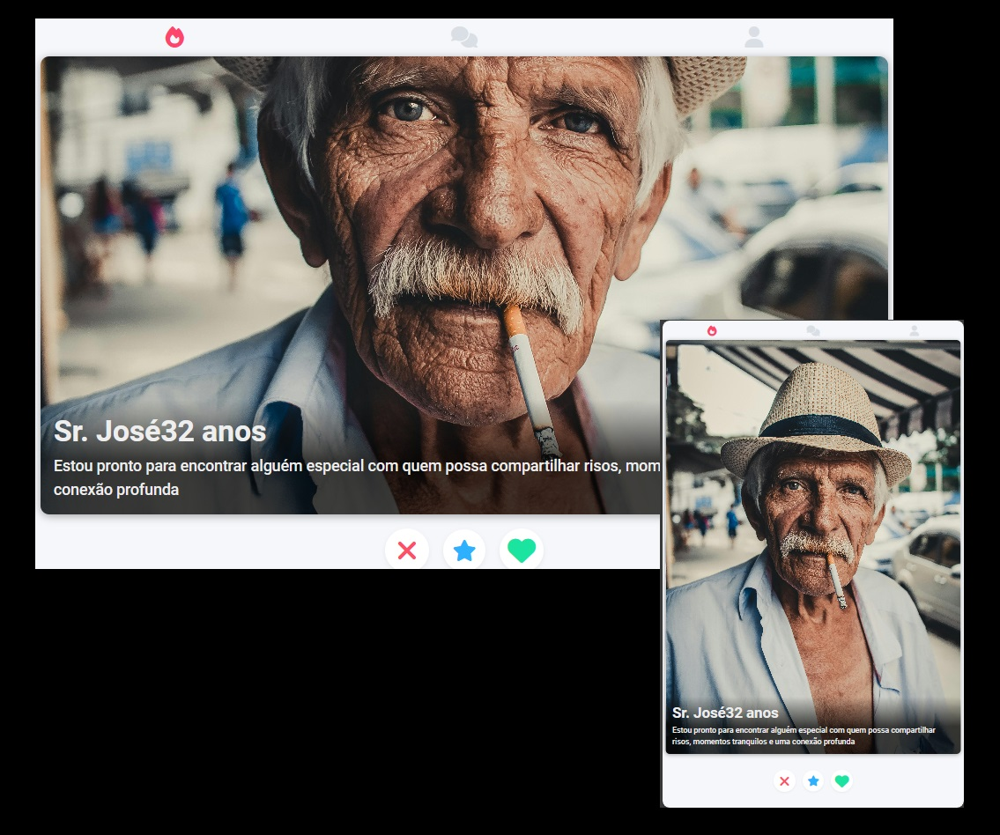

# Clone do Tinder 🤓
## Projeto👨‍💻📚
Olá pessoal! Meu nome é [Lucas Alves] e estou animado para compartilhar com vocês o projeto incrível que desenvolvi: um clone do Tinder! Durante o meu aprendizado em HTML e CSS, 
decidi desafiar minhas habilidades criando um site responsivo inspirado na famosa plataforma de relacionamentos.

## Tecnologias

 
  
  

 

# Projeto finalizado

### :memo: Licença
Esse projeto está sob a licença MIT.

---
